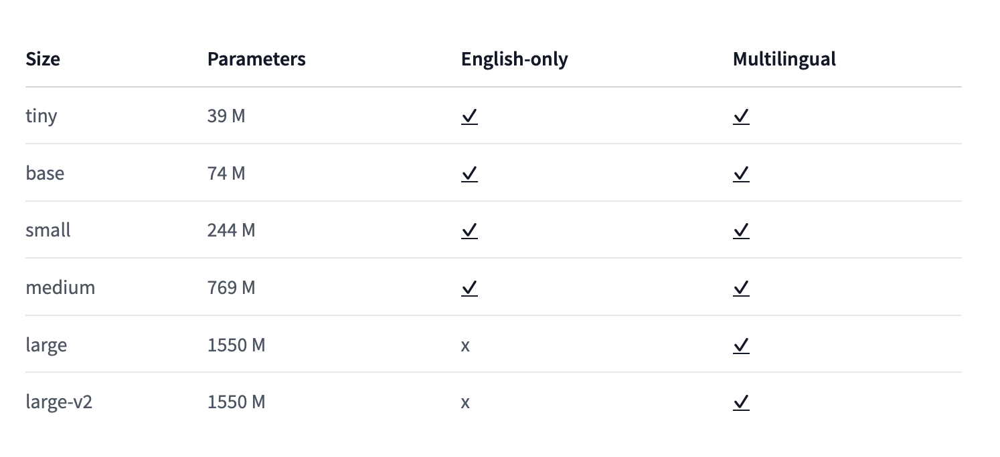

# virtual_speech_assistant

1. Speech recognition is the main part of virtual assistant. The whisper model trained on 680K hours of data.
The main idea of model indicated in the next paper - https://arxiv.org/abs/2212.04356

Whisper have own preprocessor model - WhisperProcessor, which used to convert audio to spectograms and also to convert tokens to words.

<|startoftranscript|> <|en|> <|transcribe|> <|notimestamps|> - the main parameters for whisper application.

